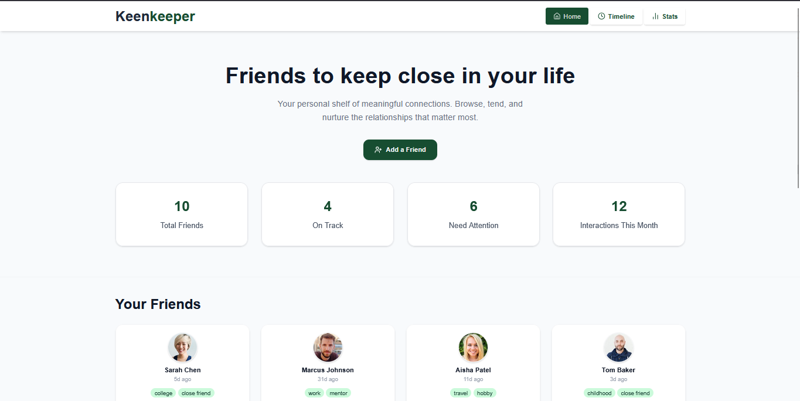
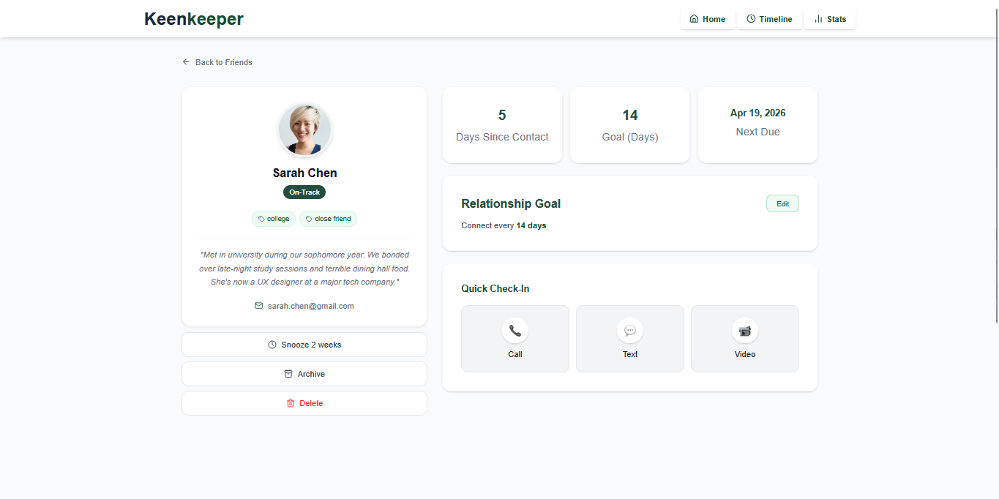
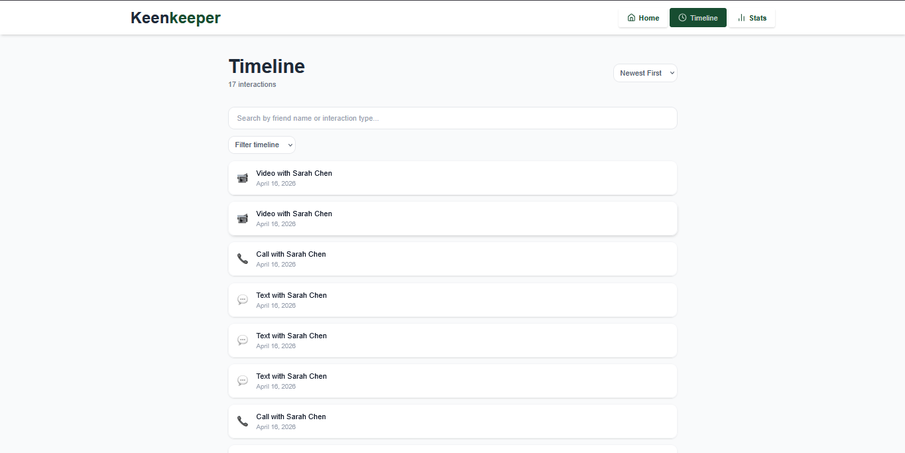
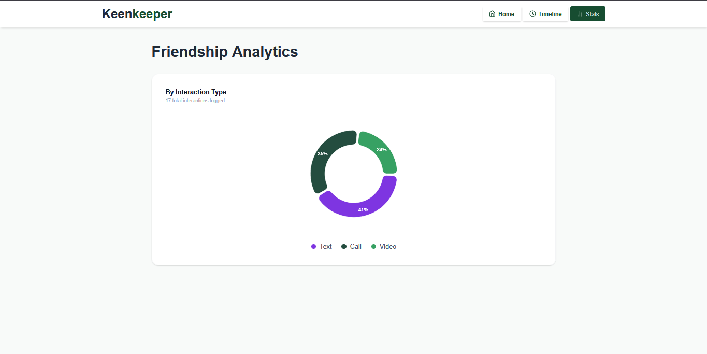

# 💚 KeenKeeper 

> A modern relationship management app that helps you stay intentional about the people who matter most in your life.

---

## 📌 About The Project

Most people don't lose friendships overnight — they fade slowly through neglect. **KeenKeeper** solves that problem by giving you a personal dashboard to track, nurture, and strengthen your most meaningful relationships.

With KeenKeeper, you can monitor how long it's been since you last reached out, set personalized contact goals for each friend, and log every interaction — whether it's a call, a text, or a video chat. The app keeps you accountable without feeling like a chore.

---

## 🛠️ Built With

| Technology | Purpose |
|---|---|
| **React.js** | Component-based UI framework |
| **React Router DOM** | Client-side routing with `createBrowserRouter` |
| **Tailwind CSS v4** | Utility-first responsive styling |
| **Context API** | Global state management for timeline data |
| **Recharts** | Interactive data visualization |
| **react-hot-toast** | Elegant toast notifications |
| **Lucide React** | Consistent icon system |
| **Vite** | Lightning-fast build tool |

---

## ✨ Key Features

### 👥 Friend Dashboard
A clean, responsive card grid showing all your friends at a glance. Each card displays the friend's profile photo, days since last contact, relationship tags, and a color-coded status badge — **On-Track**, **Almost Due**, or **Overdue** — so you always know who needs your attention.

### ⚡ Quick Check-In & Live Timeline
Every friend has a dedicated detail page with a Quick Check-In panel. With one tap you can log a **Call**, **Text**, or **Video** interaction. The entry is instantly added to the global Timeline with a toast confirmation — no forms, no friction.

### 📊 Friendship Analytics
The Stats page visualizes your interaction history through a live donut chart powered by Recharts, breaking down your connections by type. See at a glance whether you're more of a caller, texter, or video chatter — and where you might want to invest more.

---


## 📸 Screenshots

### 🏠 Home Page


### 👤 Friend Details & 📜 Timeline
| Friend Details |  Timeline |
|---|---|
|  |  |

###  📊 Friendship Analytics
 


## 🚀 Getting Started

```bash
# Clone the repository
git clone https://github.com/sanoyon211/keenkeeper.git
cd keenkeeper

# Install dependencies
npm install

# Start the development server
npm run dev

# Build for production
npm run build
```

---

## 📬 Submission

- **Live Link**: https://keenkeeper-lime.vercel.app/
- **GitHub Repository**: https://github.com/sanoyon211/keenkeeper
